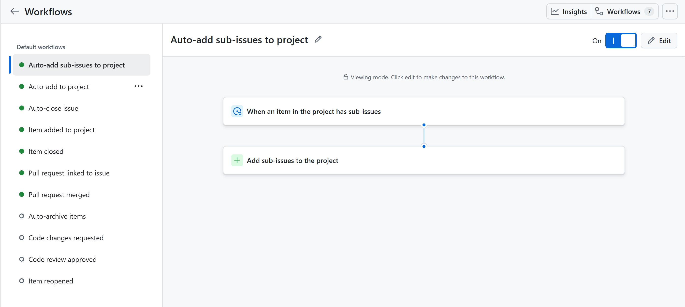

# Sprint cycle: 2026/3/17 - 2026/3/22

**Team PO**: Jing Lu

**Team SM**: Qiyin Huang

**Developers**: Qiyin Huang, Jing Lu, Xingzhuo Bao, Hang Ge, Jiachi Zhu, Sihan Wang, Yihan Wang, Yukun Wang

**Working Hours**: Sun–Fri, 10:00 AM – 12:00 AM (Saturdays off)

## Working Increment: 
This sprint successfully completed the basic setup and optimization of the core functional modules.

## Specific Incremental Details
<table>
  <thead>
    <tr>
      <th>Module</th>
      <th>This Sprint Increment</th>
      <th>Demo Evidence</th>
      <th>Person in charge</th>
    </tr>
  </thead>
  <tbody>
    <!-- Listening -->
    <tr>
      <td rowspan="4">Listening</td>
      <td>Listening exercises progress tracking implemented</td>
      <td>Create different accounts to do different listening exercises. The progress of listening practice differs under different accounts, and it can correctly reflect the user's practice progress. </td>
      <td>Qiyin Huang</td>
    </tr>
    <tr>
    <td>Question progress tracking implemented</td>
    <td>Choose to continue from the last progress to see the answer results last time. Choosing to continue from the last progress will retain the previously correct answer records, and the questions that were not answered or answered incorrectly will be asked again.</td>
    <td>Qiyin Huang</td>
    </tr>
    <tr>
      <td>Listening exercise library expanded</td>
      <td>Each video includes: Title, Description, Duration, Playback functionality. All three newly added videos can be clicked and played smoothly, the video playback feature works as expected.</td>
      <td>Jing Lu</td>
    </tr>
    <tr>
      <td>Difficulty filter added</td>
      <td>1. By default, all exercises (including the three newly added videos) are displayed.   
      2. After selecting a specific difficulty level, only videos with the corresponding difficulty are shown.  
      3. The selected difficulty button is correctly highlighted, providing clear visual feedback.  
    This confirms that both the filtering logic and UI interaction are functioning properly.
 </td>
      <td>Jing Lu</td>
    </tr>
    <!-- Speaking -->
    <tr>
    <td rowspan="5">Speaking</td>
    <td>Implemented the basic speaking user interface</td>
    <td>The "English Corner" and "Academic Scenarios" two sections can be displayed correctly, and the detailed exercises are arranged correctly by theme. </td>
    <td>Hang Ge</td>
    </tr>
    <tr>
    <td>Implemented audio uploading function</td>
    <td>The user enters the English corner, and then can choose the corresponding topic to upload their own recording for practice. </td>
    <td>Hang Ge</td>
    </tr>
    <tr>
      <td>Adding and deleting the topic in English Corner</td>
      <td>The user can add a new topic to the topic list, and new themes added by users can be chosen to be deleted. </td>
      <td>Xingzhuo Bao</td>
      </tr>
      <tr>
      <td>Recordings synchronization and deleting in English Cornor</td>
    <td>After uploading their own recordings, users can click 'view details' to manage the recordings they have uploaded, and at the same time check the feedback received for that recording. In management, users can delete the recording if they no longer need it.</td>
    <td>Xingzhuo Bao</td>
</tr>
<tr>
    <td>Academic scenario interface designing and implementation</td>
    <td>Scenarios of different themes are displayed in the interface and categorized according to different themes. After clicking into the scenario simulation, there will be a brief description of the scene and tasks, and users can upload recordings based on the scenario.</td>
    <td>Xingzhuo Bao</td>
    </tr>
    <!-- Forum -->
    <tr>
    <td rowspan="3">Forum</td>
    <td>Reply to comment implemented</td>
    <td>1. Bottom form triggers with "@username" prefix; comments display in grid with correct parent_id.  2. Quote box scrolls to and highlights original comment; cancel clears form. 3. Empty submissions (only "@" prefix) are intercepted with prompt.</td>
    <td>Jiachi Zhu</td>
    </tr>
    <tr>
    <td>Comment Like, Save, and Anchor Navigation</td>
    <td>1. Like/Save icons toggle colors and counters accurately; page does not jump to top. 2. "All Posts" and "My Saved" tabs switch seamlessly; empty states display correctly. Saved items show solid bookmark icon. 3. Clicking saved comment navigates to post, scrolls to comment, and applies brief highlight.</td>
    <td>Jiachi Zhu</td>
    <tr>
    <td>Forum category filtering, dynamic badges, and weighted hotness recommendation algorithm</td>
    <td>1. Category filters work in both tabs; badges display correct dynamic colors. 2. Posts sorted by hotness score (time decay formula), balancing new and quality content. 3. New post category dropdown renders correctly, with placeholder pre-selected.</td>
    <td>Jiachi Zhu</td>
    </tr>
    </tr>
    <!-- Vocabulary -->
    <tr>
    <td rowspan="2">Vocabulary</td>
    <td>Design and implement the vocabulary interface</td>
    <td>Dictionary resources are displayed on the interface categorized by theme. </td>
    <td>Yukun Wang</td>
    </tr>
    <tr>
    <td>Implement basic word memorization functions</td>
    <td>The user clicks on a topic and enters the vocabulary learning interface. For each vocabulary word, you can choose Known or Unknown, and after selecting, the correct definition will be displayed for learning/reinforcement.  If these words have been studied three times, the status will change to learning, and after being studied five times, the status will change to master. </td>
    <td>Yukun Wang</td>
    </tr>
    <!-- Standardize the testing process -->
    <tr>
    <td rowspan="2">AutoTesting</td>
    <td>Design and implement the automatic testing</td>
    <td> When developers want to submit our current work progress on GitHub, the system will automatically run tests.</td>
    <td>Yihan Wang</td>
    </tr>
    <tr>
     <td>Integrate database</td>
    <td> Different versions and database modifications by different team members were successfully merged into the latest version. </td>
    <td>Yihan Wang</td>
    </tr>
    <!-- Dashboard -->
    <tr>
    <td rowspan="2">Dashboard</td>
    <td>Dashboard Overall Guidance vertical scroll + Guidance subpages (blank)</td>
    <td>1. Overall Guidance is a vertically scrollable list; visible area shows ~3 mini-cards. 2. Mouse wheel/trackpad scrolls smoothly within the panel without affecting page scroll. 3. Each mini-card clicks navigates to its dedicated content page.</td>
    <td>Yihan Wang</td>
    </tr>
    <tr>
    <td>Dashboard Schedule Calendar (Fixed Size, Month Navigation & Modal Save Flow)</td>
    <td>1. Calendar container size remains constant when switching months; surrounding elements do not shift. 2. Prev/Next month buttons work, including cross-year transitions. 3. Month/year header updates instantly. 4. Selected date persists only if visible in the new grid; otherwise clears. 5. "Add" stages items as pending; "Save changes" commits all changes and closes modal. 6. Cancel or closing modal discards pending changes; reopening shows only persisted data. 7. Dropdown options and modal actions are displayed in English.
    <td>Sihan Wang</td>
    </tr>
  </tbody>
</table>

## Feedback Captured
<table>
  <thead>
    <tr>
      <th>Module</th>
      <th>Feedback Captured</th>
    </tr>
  </thead>
  <tbody>
    <!-- Listening -->
    <tr>
      <td rowspan="1">Listening</td>
      <td>It is recommended to add practice materials from different regions and with different accents to accommodate various pronunciation habits.</td>
    </tr>
    <!-- Speaking -->
    <tr>
      <td rowspan="1">Speaking</td>
      <td>Hope that spoken practice recordings made by individuals receive feedback through a certain channel</td>
    </tr>
    <!-- Work Management -->
    <tr>
      <td rowspan="2">Work Management</td>
      <td>Work division should allocate efforts to concentrate on overcoming the important parts of the project.</td>
    <tr>
      <td>Development goals should be more focused on client needs and feedbacks.</td>
    </tr>
  </tbody>
</table>